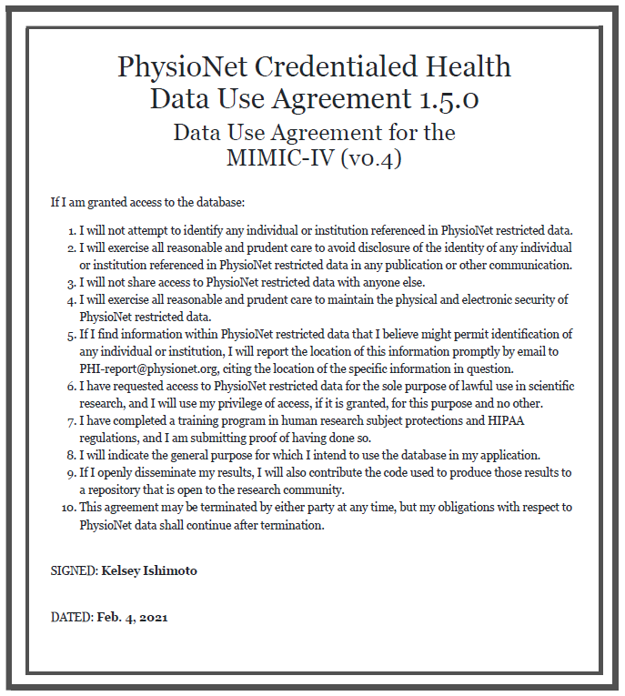

Display machine information for reproducibility:
```{r}
sessionInfo()
```

```{r setup, eval=TRUE}
knitr::opts_chunk$set(echo = TRUE, cache = TRUE)
library(tidyverse)
library(data.table)
library(lubridate)
```

```{r}
os <- sessionInfo()$running
if (str_detect(os, "Linux")) {
  mimic_path <- "/usr/203b-data/mimic-iv"
} else if (str_detect(os, "macOS")) {
  mimic_path <- "/Users/huazhou/Documents/Box Sync/MIMIC/mimic-iv-0.4"
}
```

Use tidyverse (ggpot2, dplyr) to explore the [MIMIC-IV](https://mimic-iv.mit.edu) data introduced in [homework 1](https://ucla-biostat203b-2021winter.github.io/hw/hw1/hw1.html).

```{r}
system(str_c("tree -s -L 2 ", shQuote(mimic_path)), intern = TRUE)
```

## Q1. PhysioNet credential

At this moment, you should already get credentialed on the PhysioNet. Please include a screenshot of your `Data Use Agreement for the MIMIC-IV (v0.4)`.

**Solution:**
<p align="center">

</p>


## Q2. `read.csv` (base R) vs `read_csv` (tidyverse) vs `fread` (data.table)

There are quite a few utilities in R for reading data files. Let us test the speed of reading a moderate sized compressed csv file, `admissions.csv.gz`, by three programs: `read.csv` in base R, `read_csv` in tidyverse, and `fread` in the popular data.table package. Is there any speed difference?

In this homework, we stick to the tidyverse. 

**Solution: (editing needed later)**

```{r, eval=FALSE}
system.time(read.csv(str_c(mimic_path, "/core/admissions.csv.gz")))

system.time(read_csv(str_c(mimic_path, "/core/admissions.csv.gz")))

system.time(fread(str_c(mimic_path, "/core/admissions.csv.gz")))
```

The function `read.csv` took about 46 seconds to run on my machine. Whereas `read_csv` took only about 5 seconds to run. And `fread` took about 2 seconds to run.

**change eval = FALSE later -- I just want to speed up my knitting while doing this homework.**

## Q3. ICU stays

`icustays.csv.gz` (<https://mimic-iv.mit.edu/docs/datasets/icu/icustays/>) contains data about Intensive Care Units (ICU) stays. Summarize following variables using appropriate numerics or graphs:   

- how many unique `stay_id`?  
- how many unique `subject_id`?  
- length of ICU stay  
- first ICU unit  
- last ICU unit  

**Solution:**
First read in `icustays` data:

```{r}
icustays_tble <- read_csv(str_c(mimic_path, "/icu/icustays.csv.gz"))
print(icustays_tble, width = Inf)
```

How many unique `stay_id`s?
```{r}
icustays_tble %>% 
  distinct(stay_id) %>% 
  nrow()
```
There are 69619 unique `stay_id`s. It seems that each row is a unique ICU stay. (number of rows is the same as the number of rows of original tibble)

How many unique `subject_id`s?
```{r}
icustays_tble %>% 
  distinct(subject_id) %>% 
  nrow()
```
One patient can have more than one ICU stays.

-length of ICU stays (histogram)
```{r}
icustays_tble %>% 
  ggplot() +
  geom_histogram(mapping = aes(x = los)) +
  labs(xlabel = "Length of stay (days)")
```

or we can try a boxplot:
```{r}
icustays_tble %>% 
  ggplot() +
  geom_boxplot(mapping = aes(x = los)) +
  labs(xlabel = "Length of stay (days)")
```

Why so many high `los`? Let's see those outliers more than 100 days. 

```{r}
icustays_tble %>% 
  filter(los >=100)
```

- First ICU unit
```{r}
icustays_tble %>% 
  group_by(first_careunit)
```


- Last ICU unit

## Q4. `admission` data

Information of the patients admitted into hospital is available in `ADMISSION.csv.gz`. See <https://mimic-iv.mit.edu/docs/datasets/core/admissions/> for details of each field in this file. Summarize following variables using appropriate graphs. Explain any patterns you observe.   

- admission year  
- admission month  
- admission month day  
- admission week day  
- admission hour (anything unusual?)  
- number of deaths in each year  
- admission type  
- number of admissions per patient  
- admission location  
- discharge location  
- insurance  
- language  
- martial status  
- ethnicity  
- death 

Note it is possible that one patient (uniquely identified by the `SUBJECT_ID`) is admitted into hospital multiple times. When summarizing some demographic information, it makes sense to summarize based on unique patients. 

**Solution Notes:**
- use tidyverse, categorical data -- use graphs

First read in the data:
```{r, eval = FALSE}
admissions_tble <- read_csv(str_c(mimic_path, "/core/admissions.csv.gz"))
```

Summarize analysis either by unique patients or not, just make an argument either way.


For the death information: if `deathtime` is not missing (!is.na), then `hospital_expire_flag` should be 1 --> we need to check this hypothesis. If these two variables agree then we can use either one for our `death` data. Otherwise, we have to make a choice (probably need to read the documentation to see which one is a better indication (less error)).

## Q5. `patient` data

Explore `patients.csv.gz` (<https://mimic-iv.mit.edu/docs/datasets/core/patients/>) and summarize following variables using appropriate numerics and graphs:  

- `gender`  
- `anchor_age` (explain pattern you see)

**Solution Notes: **
- need to understand what `anchor_age` means

```{r}
patients_tble <- read_csv(str_c(mimic_path, "/core/patients.csv.gz"))
print(patients_tble, width = Inf)

```

## Q6. Lab results

`labevents.csv.gz` (<https://mimic-iv.mit.edu/docs/datasets/hosp/labevents/>) contains all laboratory measurements for patients. 

We are interested in the lab measurements of creatinine, potassium, sodium, chloride, bicarbonate, hematocrit, white blood cell count, glucose, magnesium, calcium, phosphorus, and lactate. Find the `itemid`s of these lab measurements from `d_labitems.csv.gz` and retrieve a subset of `labevents.csv.gz` only containing these items.

**Solution Notes:**
- there are many lab events, but collect the above lab measurements from those two data files.
- tidyverse merging and whatnot
- the data files, even after compression, are very large, and there is some trouble reading the data

The following file is so large. Normally we would want to use a database in order to read in this file. But without using a database.
```{r, eval = FALSE}
labevents_tble <- read_csv(str_c(mimic_path, "/hosp/labevents.csv.gz"))
```

Let's just take a look at the first few lines of the labevents data:
```{r}
system(str_c("zcat < ", shQuote(str_c(mimic_path, "/hosp/labevents.csv.gz")),
             " | head"), intern = TRUE)
```

We only need some variables: subject id, labevent id, hadm id, itemid, charttime, valuenum

Dr. Zhou used `read_csv` and only read in those above columns --> but it's still too much memory

use data.table

Code from Dr. Zhou:
took 200 seconds
```{r, eval = FALSE}
if (!file.exists("labevents_icustays.csv.gz")) {
  labevents_tble <- fread(str_c(mimic_path, "/hosp/labevents.csv.gz"),
                        select("subject_id", "hadm_id", "itemid", 
                               "charttime", "valuenum"),
                        nThread = 4)
  labevents_tble %>% 
  semi_join(icustays_tble, by = c("subject_id", "hadm_id")) %>% 
  fwrite("labevents_icustays.csv.gz", nThread = 4)
}

# 15 seconds, will take about 17 seconds with nThread = 1 (default)
labevents_tble <- fread("labevents_icustays.csv.gz", nThread = 4)

labevents_tble %>% 
  as_tibble() %>% 
  print(width = Inf)
```

Now we only want some lab item ids: read in the lab item dictionary
```{r}
dlabitmes_tble <- 
  read_csv(str_c(mimic_path, "/hosp/d_labitems.csv.gz")) %>% 
  print(width = Inf)
```

We can just use the codes provided in the homework assignment. and just keep the rows of the labevents that just have those labitemids.


## Q7. Vitals from chartered events

We are interested in the vitals for ICU patients: heart rate, mean and systolic blood pressure (invasive and noninvasive measurements combined), body temperature, SpO2, and respiratory rate.

`chartevents.csv.gz` (<https://mimic-iv.mit.edu/docs/datasets/icu/chartevents/>) contains all the charted data available for a patient. During their ICU stay, the primary repository of a patient’s information is their electronic chart. The `ITEMID` variable indicates a single measurement type in the database. The `VALUE` variable is the value measured for `ITEMID`. 

`d_items.csv.gz` (<https://mimic-iv.mit.edu/docs/datasets/icu/d_items/>) is the dictionary for the `ITEMID` in `CHARTEVENTS.csv`. Find potential values of `ITEMID` that correspond to systolic blood pressure, i.e., `LABEL` contains the string `systolic`. 


## Q8. Putting things together

Let us create a tibble for all ICU stays, where rows are  

- first ICU stay of each unique patient  
- adults (age at admission > 18)  ~ from the admission table

and columns contains at least following variables  

- all variables in `icustays.csv.gz`  
- all variables in `admission.csv.gz` 
- all the variables in `patients.csv.gz`
- first lab measurements during ICU stay  
- first vitals measurement during ICU stay  
- an indicator variable whether the patient died within 30 days of hospital admission  

only getting the first ICU stay of each unique patient:
```{r, eval = F}
icustays_tble %>% 
  # just keep first ICU stay for each unique subject id
  group_by(subject_id) %>% 
  slice_min(intime) %>% 
  # merge admissions tibble
  left_join(admissions_tble, by = c("subject_id", "hadm_id")) %>% 
  # merge patients tibble
  left_join(patients_tble, by = "subject_id") %>% 
  # only keep adults (age at admission >= 18)
  mutate(age_at_adm = year(admittime) - anchor_year + anchor_age) %>% 
  filter(age_at_adm >= 18) %>% 
  # want lab measurement for first ICU stay
  # look at labitem's chart time and make sure its between the intime and outime
  # for each subject id
  print(width = Inf) 
```
age at admission = anchor_year - admission_year + anchor_age


