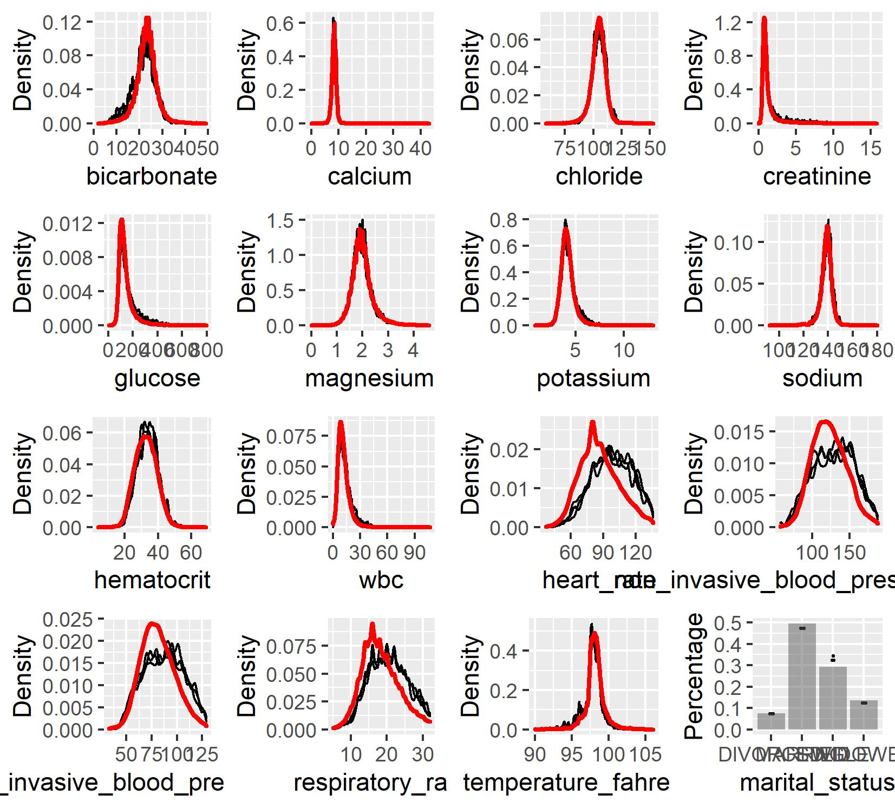
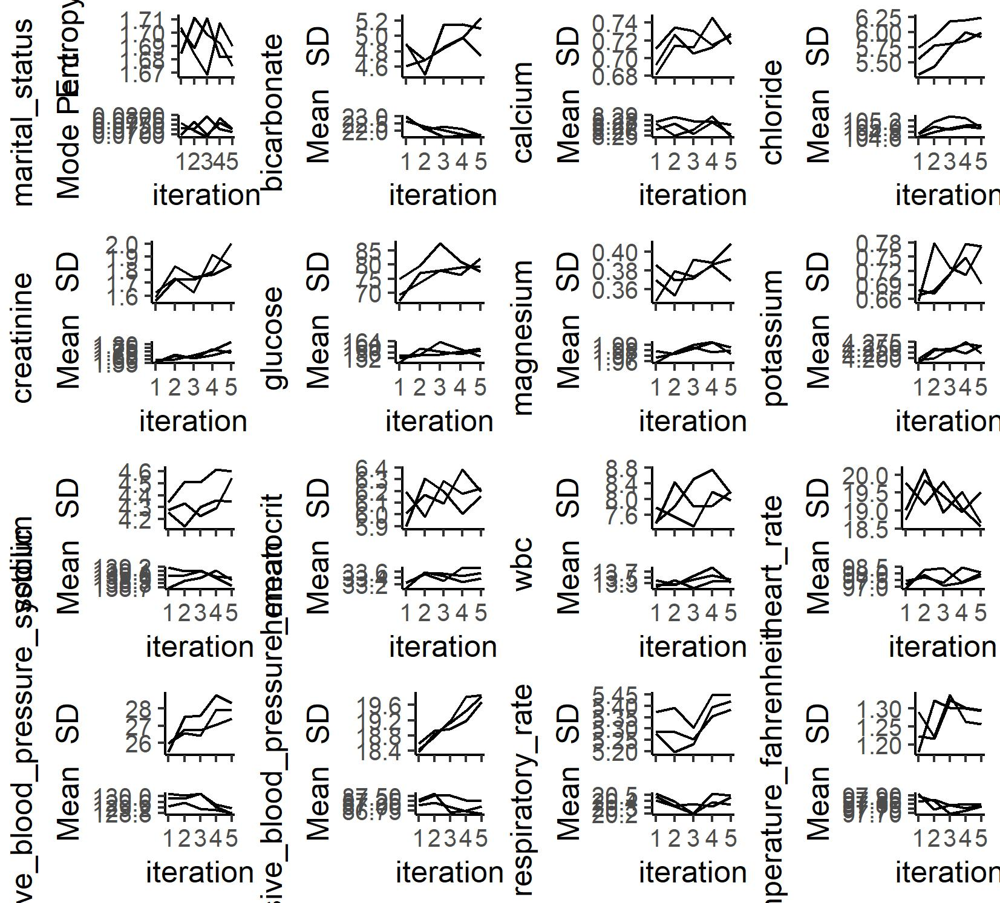

```{r, include = FALSE}
knitr::opts_chunk$set(echo = TRUE, cache = TRUE)
```
                      
Display machine information:
```{r}
sessionInfo()
```
Load database libraries and the tidyverse frontend:
```{r, warning = F, message = F}
library(tidyverse)
library(lubridate)
library(miceRanger)
library(randomForest)
```

## Q1. Missing data

Through the Shiny app developed in HW3, we observe abundant missing values in the MIMIC-IV ICU cohort we created. In this question, we use multiple imputation to obtain a data set without missing values.

0. Read following tutorials on the R package miceRanger for imputation: <https://github.com/farrellday/miceRanger>, <https://cran.r-project.org/web/packages/miceRanger/vignettes/miceAlgorithm.html>.

    A more thorough book treatment of the practical imputation strategies is the book [*_Flexible Imputation of Missing Data_*](https://stefvanbuuren.name/fimd/) by Stef van Buuren. 

### Q1 Solution:

#### Part 1: Explain the jargon MCAR, MAR, and MNAR.
 _Question was answered by making reference to the IDRE Multiple Imputation in R course_ 

**MCAR - Missing Completely at Random**

When a variable has values that are missing completely at random, values of other variables does not predict whether a value will be missing, nor does the unobserved value of the variable itself predict whether a value will be missing. In this case, analyzing only the complete cases will not result in biased parameter estimates. 

**MAR - Missing at Random**

When a variable is missing at random, values of other variables _can_ be used to predict whether our variable of interest is missing. Still, however, the unobserved value of the variable itself _cannot_ be used to predict missingness.

**MNAR - Missing Not at Random**

When a variable is missing not at random, the unobserved value of the variable _can_ be used to predict whether a value will be missing or not. 

#### Part 2: Explain how Multiple Imputation by Chained Equations (MICE) works.

To determine what value to impute for missing values, the other variables in the data can be used in predictive models. Furthermore, these values can have some random error added to them in order to preserve some of the variability from the original data. What MICE does is run this process _m_ number of times until all specified variables have been imputed and the average imputed values have converged.


#### Part 3: Perform a data quality check of the ICU stays data. 
_Discard variables with substantial missingness, say >5000 `NA`s. Replace apparent data entry errors by `NA`s._

First, read in the data:
```{r}
icu_cohort <- readRDS("icu_cohort.rds")
```

Next, we need to see if there are data entry errors, and make sure that missing data is coded as `NA`. Before I go into the analysis. I want to say that I have little to no knowledge of ranges for normal vital measurements. I used one of two criteria to determine a range of "possible" (i.e. not impossible data-entry error) values for variables. Unless otherwise stated, for the vital measurements I have used the rule: 1.5 times the interquartile range to determine the steps from the first and third quartile to determine the range of "normal" values. Anything outside of this range are values that I will treat as data entry errors and re-coded as `NA`. And for the lab measurements, unless otherwise stated, I have used zero as the lower bound of possible values and the 99.9th percentile for the possible upper bounds. These are ranges that could be adjusted in the future by consulting with the people who provided the data if needed.

Also, when looking at the lab measurements from the descriptive plots made in the previous homework, it does not seem that all distributions have egregious outliers. Keeping this in mind, I will only be looking at the measurements whose distributions look like there could be measurement errors (many high outliers). These variables include: `creatinine`, `glucose`, `magnesium`, `potassium`, and `WBC`. 

_Vital Measurements_

Now, I will start by looking at heart rate. Normally, the heart rate shouldn't be below 60 beats per minute (bpm) nor above 200 bpm. When sleeping, the heart rate can fall to as low as 40 bpm. Using the 1.5 times IQR to find the range of values to keep:

```{r}
Q <- quantile(icu_cohort$heart_rate, 
         probs = c(0.05, 0.25, 0.75, 0.95), na.rm = TRUE)
names(Q) <- NULL
lower <- Q[2] - (Q[3] - Q[2]) * 1.5
upper <- Q[3] + (Q[3] - Q[2]) * 1.5

print(c(lower, upper))
```
The range of values I will retain is 36.5 to 136.5.


```{r}
for (i in 1:50048) {
  if (!is.na(icu_cohort$heart_rate[i]) & 
      icu_cohort$heart_rate[i] < lower) {
    icu_cohort$heart_rate[i] <- NA
  } else if (!is.na(icu_cohort$heart_rate[i]) & 
             icu_cohort$heart_rate[i] > upper) {
    icu_cohort$heart_rate[i] <- NA
  }
}

icu_cohort %>% 
  select(heart_rate) %>% 
  filter(!is.na(.)) %>% 
  summarize(min = min(.), max = max(.))
```

Next, we look at non-invasive blood pressure systolic. For an adult, the normal systolic blood pressure should be below 120 mm Hg but above 90 mm Hg. A hypertensive crisis is when systolic blood pressure is above 180 mm Hg.

Determining cutoff points for outliers for non-invasive systolic blood pressure using 1.5 times the interquartile range (IQR) as the criteria for outliers / data entry errors:
```{r}
Q <- quantile(icu_cohort$non_invasive_blood_pressure_systolic, 
         probs = c(0.05, 0.25, 0.75, 0.95), na.rm = TRUE)
names(Q) <- NULL
lower <- Q[2] - (Q[3] - Q[2]) * 1.5
upper <- Q[3] + (Q[3] - Q[2]) * 1.5

print(c(lower, upper))
```
The range of values I will retain in the data set are: 56.5 to 188.5

Treating anything outside the previous range as data entry errors, I will code them as `NA`.
```{r}
for (i in 1:50048) {
  if (!is.na(icu_cohort$non_invasive_blood_pressure_systolic[i]) & 
      icu_cohort$non_invasive_blood_pressure_systolic[i] < lower) {
    icu_cohort$non_invasive_blood_pressure_systolic[i] <- NA
  } else if (!is.na(icu_cohort$non_invasive_blood_pressure_systolic[i]) & 
             icu_cohort$non_invasive_blood_pressure_systolic[i] > upper) {
    icu_cohort$non_invasive_blood_pressure_systolic[i] <- NA
  }
}


icu_cohort %>% 
  select(non_invasive_blood_pressure_systolic) %>% 
  filter(!is.na(non_invasive_blood_pressure_systolic)) %>% 
  summarize(min = min(.), max = max(.))
```

Next, we look at non-invasive blood pressure mean. The normal range should be around 75 mm Hg to 100 mm Hg.

```{r}
Q <- quantile(icu_cohort$non_invasive_blood_pressure_mean, 
         probs = c(0.05, 0.25, 0.75, 0.95), na.rm = TRUE)
names(Q) <- NULL
lower <- Q[2] - (Q[3] - Q[2]) * 1.5
upper <- Q[3] + (Q[3] - Q[2]) * 1.5

print(c(lower, upper))
```

The range of values I will retain are 33 mm Hg to 129 mm Hg.

```{r}
for (i in 1:50048) {
  if (!is.na(icu_cohort$non_invasive_blood_pressure_mean[i]) & 
      icu_cohort$non_invasive_blood_pressure_mean[i] < lower) {
    icu_cohort$non_invasive_blood_pressure_mean[i] <- NA
  } else if (!is.na(icu_cohort$non_invasive_blood_pressure_mean[i]) & 
             icu_cohort$non_invasive_blood_pressure_mean[i] > upper) {
    icu_cohort$non_invasive_blood_pressure_mean[i] <- NA
  }
}

icu_cohort %>% 
  select(non_invasive_blood_pressure_mean) %>% 
  filter(!is.na(non_invasive_blood_pressure_mean)) %>% 
  summarize(min = min(.), max = max(.))

```

Next, I will look at respiratory rate. For a normal adult, the range should be around 12 to 20 breaths per minute. 

```{r}
Q <- quantile(icu_cohort$respiratory_rate, 
         probs = c(0.05, 0.25, 0.75, 0.95), na.rm = TRUE)
names(Q) <- NULL
lower <- Q[2] - (Q[3] - Q[2]) * 1.5
upper <- Q[3] + (Q[3] - Q[2]) * 1.5

print(c(lower, upper))
```

The range of values I will retain are between 4.5 and 32.5 breaths per minute.

```{r}
for (i in 1:50048) {
  if (!is.na(icu_cohort$respiratory_rate[i]) & 
      icu_cohort$respiratory_rate[i] < lower) {
    icu_cohort$respiratory_rate[i] <- NA
  } else if (!is.na(icu_cohort$respiratory_rate[i]) & 
             icu_cohort$respiratory_rate[i] > upper) {
    icu_cohort$respiratory_rate[i] <- NA
  }
}

icu_cohort %>% 
  select(respiratory_rate) %>% 
  filter(!is.na(respiratory_rate)) %>% 
  summarize(min = min(.), max = max(.))
```

Next is temperature in Fahrenheit. The normal range is 97.7 - 99.5 degrees Fahrenheit. 95 degrees or lower is classified as hypothermia, and 106 and higher is classified as hyperrexia. 


```{r}
Q <- quantile(icu_cohort$temperature_fahrenheit, 
         probs = c(0.05, 0.25, 0.75, 0.95), na.rm = TRUE)
names(Q) <- NULL
lower <- Q[2] - (Q[3] - Q[2]) * 1.5
upper <- Q[3] + (Q[3] - Q[2]) * 1.5

print(c(lower, upper))
```

In view of the known ranges of temperatures, I will not use the 1.5 times IQR rule to find possible data entry errors since the range that gives does not seem to be wide enough to allow for all possible values. I will instead retain values within the range of 90 to 110 degrees Fahrenheit (a wider, more conservative range than the known values since I don't actually know much about "normal" vital signs).

```{r}
for (i in 1:50048) {
  if (!is.na(icu_cohort$temperature_fahrenheit[i]) & 
      icu_cohort$temperature_fahrenheit[i] < 90) {
    icu_cohort$temperature_fahrenheit[i] <- NA
  } else if (!is.na(icu_cohort$temperature_fahrenheit[i]) & 
             icu_cohort$temperature_fahrenheit[i] > 110) {
    icu_cohort$temperature_fahrenheit[i] <- NA
  }
}

icu_cohort %>% 
  select(temperature_fahrenheit) %>% 
  filter(!is.na(temperature_fahrenheit)) %>% 
  summarize(min = min(.), max = max(.))
```

Next is arterial blood pressure systolic. The normal range for this value is 90 to 140. 


```{r}
Q <- quantile(icu_cohort$arterial_blood_pressure_systolic, 
         probs = c(0.05, 0.25, 0.75, 0.95), na.rm = TRUE)
names(Q) <- NULL
lower <- Q[2] - (Q[3] - Q[2]) * 1.5
upper <- Q[3] + (Q[3] - Q[2]) * 1.5

print(c(lower, upper))
```

I will retain values between 53 and 189 mm Hg.

```{r}
for (i in 1:50048) {
  if (!is.na(icu_cohort$arterial_blood_pressure_systolic[i]) & 
      icu_cohort$arterial_blood_pressure_systolic[i] < lower) {
    icu_cohort$arterial_blood_pressure_systolic[i] <- NA
  } else if (!is.na(icu_cohort$arterial_blood_pressure_systolic[i]) & 
             icu_cohort$arterial_blood_pressure_systolic[i] > upper) {
    icu_cohort$arterial_blood_pressure_systolic[i] <- NA
  }
}

icu_cohort %>% 
  select(arterial_blood_pressure_systolic) %>% 
  filter(!is.na(arterial_blood_pressure_systolic)) %>% 
  summarize(min = min(.), max = max(.))
```

And finally there is mean arterial blood pressure. The normal range for this value is 70 to 110. 


```{r}
Q <- quantile(icu_cohort$arterial_blood_pressure_mean, 
         probs = c(0.05, 0.25, 0.75, 0.95), na.rm = TRUE)
names(Q) <- NULL
lower <- Q[2] - (Q[3] - Q[2]) * 1.5
upper <- Q[3] + (Q[3] - Q[2]) * 1.5

print(c(lower, upper))
```

I will retain values between 34.5 mm Hg and 126.5 mm Hg.

```{r}
for (i in 1:50048) {
  if (!is.na(icu_cohort$arterial_blood_pressure_mean[i]) & 
      icu_cohort$arterial_blood_pressure_mean[i] < lower) {
    icu_cohort$arterial_blood_pressure_mean[i] <- NA
  } else if (!is.na(icu_cohort$arterial_blood_pressure_mean[i]) & 
             icu_cohort$arterial_blood_pressure_mean[i] > upper) {
    icu_cohort$arterial_blood_pressure_mean[i] <- NA
  }
}

icu_cohort %>% 
  select(arterial_blood_pressure_mean) %>% 
  filter(!is.na(arterial_blood_pressure_mean)) %>% 
  summarize(min = min(.), max = max(.))
```

_Lab Measurements_

I will now look at the creatinine variable, and determine which cutoff points I should use for determining data entry errors:
```{r}
Q <- quantile(icu_cohort$creatinine, 
         probs = c(0.001, 0.25, 0.75, 0.999), na.rm = TRUE)
#names(Q) <- NULL
lower <- Q[2] - (Q[3] - Q[2]) * 1.5
upper <- Q[3] + (Q[3] - Q[2]) * 1.5

lower1 <- Q[1]
upper1 <- Q[4]

print(c(lower, upper))
print(c(lower1, upper1))

icu_cohort %>% 
  select(creatinine) %>% 
  filter(!is.na(creatinine)) %>% 
  filter(creatinine > upper) %>% 
  # ggplot() +
  # geom_histogram(aes(x = creatinine))
  summarize(min = min(.), max = max(.), count = n())

icu_cohort %>% 
  select(creatinine) %>% 
  filter(!is.na(creatinine)) %>% 
  filter(creatinine > upper1) %>% 
  # ggplot() +
  # geom_histogram(aes(x = creatinine))
  summarize(min = min(.), max = max(.), count = n())
```

The minimum creatinine level should be zero. Taking into consideration the distribution of creatinine, and how many observations would be deleted for the above cutoffs, I will use the 99.9th percentile as the upper limit cutoff for determining data entry errors (coded as `upper1`). 

```{r}
for (i in 1:50048) {
  if (!is.na(icu_cohort$creatinine[i]) & 
      icu_cohort$creatinine[i] < 0) {
    icu_cohort$creatinine[i] <- NA
  } else if (!is.na(icu_cohort$creatinine[i]) & 
             icu_cohort$creatinine[i] > upper1) {
    icu_cohort$creatinine[i] <- NA
  }
}

icu_cohort %>% 
  select(creatinine) %>% 
  filter(!is.na(creatinine)) %>% 
  summarize(min = min(.), max = max(.))
```

Next, I will look at glucose. The minimum glucose level should be 0. 
```{r}
Q <- quantile(icu_cohort$glucose, 
         probs = c(0.001, 0.25, 0.75, 0.999), na.rm = TRUE)
#names(Q) <- NULL
lower <- Q[2] - (Q[3] - Q[2]) * 1.5
upper <- Q[3] + (Q[3] - Q[2]) * 1.5

lower1 <- Q[1]
upper1 <- Q[4]

print(c(lower, upper))
print(c(lower1, upper1))

icu_cohort %>% 
  select(glucose) %>% 
  filter(!is.na(glucose)) %>% 
  filter(glucose > upper) %>% 
  # ggplot() +
  # geom_histogram(aes(x = glucose))
  summarize(min = min(.), max = max(.), count = n())

icu_cohort %>% 
  select(glucose) %>% 
  filter(!is.na(glucose)) %>% 
  filter(glucose > upper1) %>%
  # ggplot() +
  # geom_histogram(aes(x = glucose))
  summarize(min = min(.), max = max(.), count = n())
```

The minimum glucose level should be zero, I think. Taking into consideration the distribution of glucose, and how many observations would be deleted for the above cutoffs, I will use the 99.9th percentile as the upper limit cutoff for determining data entry errors (coded as `upper1`). 

```{r}
for (i in 1:50048) {
  if (!is.na(icu_cohort$glucose[i]) & 
      icu_cohort$glucose[i] < 0) {
    icu_cohort$glucose[i] <- NA
  } else if (!is.na(icu_cohort$glucose[i]) & 
             icu_cohort$glucose[i] > upper1) {
    icu_cohort$glucose[i] <- NA
  }
}

icu_cohort %>% 
  select(glucose) %>% 
  filter(!is.na(glucose)) %>% 
  summarize(min = min(.), max = max(.))
```

Next, I will look at magnesium The minimum magnesium level should be 0. 
```{r}
Q <- quantile(icu_cohort$magnesium, 
         probs = c(0.001, 0.25, 0.75, 0.999), na.rm = TRUE)
#names(Q) <- NULL
lower <- Q[2] - (Q[3] - Q[2]) * 1.5
upper <- Q[3] + (Q[3] - Q[2]) * 1.5

lower1 <- Q[1]
upper1 <- Q[4]

print(c(lower, upper))
print(c(lower1, upper1))

icu_cohort %>% 
  select(magnesium) %>% 
  filter(!is.na(magnesium)) %>% 
  filter(magnesium > upper) %>% 
  # ggplot() +
  # geom_histogram(aes(x = magnesium))
  summarize(min = min(.), max = max(.), count = n())

icu_cohort %>% 
  select(magnesium) %>% 
  filter(!is.na(magnesium)) %>% 
  filter(magnesium > upper1) %>%
  # ggplot() +
  # geom_histogram(aes(x = magnesium))
  summarize(min = min(.), max = max(.), count = n())
```

The minimum magnesium level should be zero, I think. Taking into consideration the distribution of magnesium, and how many observations would be deleted for the above cutoffs, I will use the 99.9th percentile as the upper limit cutoff for determining data entry errors (coded as `upper1`). 

```{r}
for (i in 1:50048) {
  if (!is.na(icu_cohort$magnesium[i]) & 
      icu_cohort$magnesium[i] < 0) {
    icu_cohort$magnesium[i] <- NA
  } else if (!is.na(icu_cohort$magnesium[i]) & 
             icu_cohort$magnesium[i] > upper1) {
    icu_cohort$magnesium[i] <- NA
  }
}

icu_cohort %>% 
  select(magnesium) %>% 
  filter(!is.na(magnesium)) %>% 
  summarize(min = min(.), max = max(.))
```


Next, I will look at potassium. The minimum potassium level should be 0. 
```{r}
Q <- quantile(icu_cohort$potassium, 
         probs = c(0.001, 0.25, 0.75, 0.999), na.rm = TRUE)
#names(Q) <- NULL
lower <- Q[2] - (Q[3] - Q[2]) * 1.5
upper <- Q[3] + (Q[3] - Q[2]) * 1.5

lower1 <- Q[1]
upper1 <- Q[4]

print(c(lower, upper))
print(c(lower1, upper1))

icu_cohort %>% 
  select(potassium) %>% 
  filter(!is.na(potassium)) %>% 
  summarize(min = min(.), max = max(.))

icu_cohort %>% 
  select(potassium) %>% 
  filter(!is.na(potassium)) %>% 
  filter(potassium > upper) %>% 
  # ggplot() +
  # geom_histogram(aes(x = potassium))
  summarize(min = min(.), max = max(.), count = n())

icu_cohort %>% 
  select(potassium) %>% 
  filter(!is.na(potassium)) %>% 
  filter(potassium > upper1) %>%
  # ggplot() +
  # geom_histogram(aes(x = potassium))
  summarize(min = min(.), max = max(.), count = n())
```

Looking at the values of potassium, although the distribution is skewed, it does not seem as if there are any values that would be impossible to observe. In other words, it doesn't seem like there are any data entry errors, so no values will be marked as missing.


Next, I will look at WBC:
```{r}
Q <- quantile(icu_cohort$wbc, 
         probs = c(0.001, 0.25, 0.75, 0.999), na.rm = TRUE)
#names(Q) <- NULL
lower <- Q[2] - (Q[3] - Q[2]) * 1.5
upper <- Q[3] + (Q[3] - Q[2]) * 1.5

lower1 <- Q[1]
upper1 <- Q[4]

print(c(lower, upper))
print(c(lower1, upper1))

icu_cohort %>% 
  select(wbc) %>% 
  filter(!is.na(wbc)) %>% 
  filter(wbc > upper) %>% 
  # ggplot() +
  # geom_histogram(aes(x = wbc))
  summarize(min = min(.), max = max(.), count = n())

icu_cohort %>% 
  select(wbc) %>% 
  filter(!is.na(wbc)) %>% 
  filter(wbc > upper1) %>%
  # ggplot() +
  # geom_histogram(aes(x = wbc))
  summarize(min = min(.), max = max(.), count = n())
```

The minimum wbc level should be zero, I think. Taking into consideration the distribution of wbc, and how many observations would be deleted for the above cutoffs, I will use the 99.9th percentile as the upper limit cutoff for determining data entry errors (coded as `upper1`). 

```{r}
for (i in 1:50048) {
  if (!is.na(icu_cohort$wbc[i]) & 
      icu_cohort$wbc[i] < 0) {
    icu_cohort$wbc[i] <- NA
  } else if (!is.na(icu_cohort$wbc[i]) & 
             icu_cohort$wbc[i] > upper1) {
    icu_cohort$wbc[i] <- NA
  }
}

icu_cohort %>% 
  select(wbc) %>% 
  filter(!is.na(wbc)) %>% 
  summarize(min = min(.), max = max(.))
```

The minimum wbc level should be zero, I think. Taking into consideration the distribution of wbc, and how many observations would be deleted for the above cutoffs, I will use the 99.9th percentile as the upper limit cutoff for determining data entry errors (coded as `upper1`). 

```{r}
for (i in 1:50048) {
  if (!is.na(icu_cohort$wbc[i]) & 
      icu_cohort$wbc[i] < 0) {
    icu_cohort$wbc[i] <- NA
  } else if (!is.na(icu_cohort$wbc[i]) & 
             icu_cohort$wbc[i] > upper1) {
    icu_cohort$wbc[i] <- NA
  }
}

icu_cohort %>% 
  select(wbc) %>% 
  filter(!is.na(wbc)) %>% 
  summarize(min = min(.), max = max(.))
```


Taking a look at the 30 day death indicator:
```{r}
unique(icu_cohort$death30days)
```
There are missing values for the 30 day death indicator. Looking at how I defined this data set previously, this variable is coded as `NA` when time of death is missing. Reading the documentation of the MIMIC-IV data, it says, “Note that `deathtime` is only present if the patient died in-hospital, and is almost always the same as the patient’s `dischtime`. However, there can be some discrepancies due to typographical errors.” To eliminate the missing values for this variable, I will redefine the `death30days` indicator variable, using discharge time instead of the missing death time for calculating how long the patient survived in the hospital for. 

```{r}
icu_cohort <- icu_cohort %>% 
  mutate(death30days = hospital_expire_flag)

for (i in 1:50048) {
  if (icu_cohort$hospital_expire_flag[i] == 1 & 
      !is.na(icu_cohort$deathtime[i])) {
    icu_cohort$death30days[i] <- 
      (icu_cohort$deathtime[i] - icu_cohort$admittime[i]) < ddays(30)
  } else if (icu_cohort$hospital_expire_flag[i] == 1 & 
             is.na(icu_cohort$deathtime[i])) {
    icu_cohort$death30days[i] <- 
      (icu_cohort$dischtime[i] - icu_cohort$admittime[i]) < ddays(30)
  }
}

unique(icu_cohort$death30days)
```


Finding the number of missing values in each column:
```{r}
col <- colnames(icu_cohort)

num_missing <- rep(0, 46)

# matrix to indicate whether value is missing or not
miss_mat <- icu_cohort %>% 
  is.na()

# summing up the number of missing values for each variable:
for (i in 1:46) {
  num_missing[i] <- sum(miss_mat[, i])
}

for (i in which(num_missing > 5000)) {
  print(col[i])
  print(num_missing[i])
}
```

Now to discard variables with substantial missingness (> 5,000 `NA`s). Note that I have also dropped variables that I will not be using in the final analysis in Question 2:
```{r}
icu_dropped <- icu_cohort %>% 
  select(-edregtime, -edouttime, -lactate, 
         -arterial_blood_pressure_systolic, -arterial_blood_pressure_mean,
         -hadm_id, -stay_id, -first_careunit, -last_careunit,
         -intime, -outtime, -los, -admittime, -dischtime, -deathtime, 
         -admission_type, -admission_location, -discharge_location,
         -insurance, -language, -anchor_age, -anchor_year, -anchor_year_group,
         -dod)

colnames(icu_dropped)
```


#### Part 4: Impute missing values by `miceRanger` (request $m=3$ datasets). 

Note: The following code took a about an hour for me to run on my local computer. In order to prevent the TAs from having to wait that long for this to run, I have saved outputs from this code as files that will be included in the knitted file. 
```{r}
if(!file.exists("icu_comp.rds")) {
  require(miceRanger)
  set.seed(68519)

  # Perform mice, return 3 datasets. 
  seqTime <- system.time(
     miceObj <- miceRanger(icu_dropped, m = 3, returnModels = TRUE,
                        verbose = FALSE, max.depth = 10))
  icu_comp <- completeData(miceObj)
  head(icu_comp[[1]])
  saveRDS(icu_comp, file = "icu_comp.rds")
  
  distributions <- plotDistributions(miceObj)
  ggsave("graphs/distributions.jpeg")
  
  correlations <- plotCorrelations(miceObj)
  ggsave("graphs/correlations.jpeg")
  
  convergence <- plotVarConvergence(miceObj)
  ggsave("graphs/convergence.jpeg")
}
```

Now we can load in file with the 3 imputed data sets generated by the previous code.
```{r}
icu_comp <- readRDS("icu_comp.rds")

icu_comp1 <- icu_comp[[1]]
icu_comp2 <- icu_comp[[2]]
icu_comp3 <- icu_comp[[3]]
```


#### Part 5: Imputation Diagnositc Plots
```{r}
if (exists('distributions')) {
  print(distributions)
}
```

The following code was written in reference to the _R Markdown Cookbook_ written by Yihui Xie, Christophe Dervieux, and Emily Riederer:

```{r, results="asis"}
if (!exists("distributions")) {
  cat("")
}
```


These plots compare the imputed distributions (black lines or black dots) to the original distributions (red line or the grayed out bar plot). There are multiple black lines because each black line corresponds to a single generated data set. Here we can see if the imputation preserved the features of the data set or not. We can see that the distributions from the imputation mostly follows the original distributions for the lab measurements, however, they don't follow the original distributions very closely for the vital measurements. 

```{r}
if (exists("correlations")) {
  print(correlations)
}
```

```{r, results = "asis"}
if (!exists("correlations")) {
  cat("")
}  
```

The above plots allow us to examine if the imputed values of our datasets converged or not. The correlations above is between imputed values in every combination of datasets.

```{r}
if (exists("convergence")) {
  print(convergence)
}
```

```{r, results = "asis"}
if (!exists("convergence")) {
  cat("")
}
```

The above plots help us to examine the convergence of measures of center and variance for our imputed variables over the iterations. 

#### Part 6: Obtain complete data by averaging 3 imputed data sets

I will actually be making two complete data sets: one with categorical variables coded with dummy variables (to use with logistic regression), and one with categorical variables not coded as dummy variables (to use with random forests). 

I will make the complete data set with dummy variables first. I start by converting the three data sets to matrices, with each categorical variable coded with dummy variables. Then I will average over the three data sets and convert it back into a data frame:
```{r}
mat1 <- model.matrix(~ ., data = icu_comp1)
mat2 <- model.matrix(~ ., data = icu_comp2)
mat3 <- model.matrix(~ ., data = icu_comp3)

icu_final <- as.data.frame((mat1 + mat2 + mat3) / 3)
```

Now I will check how the categorical variables were averaged, and adjust them if needed. I also want to make sure that `death30days` is treated as a factor. Furthermore, the variable `hospital_expire_flag`, `(Intercept)`, and `subject_id` will not be used in the final analysis, so I will drop them.
```{r}
# gender is coded correctly
icu_final %>% 
  select(genderM) %>% 
  unique(.)

# need to adjust the marital status variable
icu_final <- icu_final %>% 
  mutate(marital_statusMARRIED = marital_statusMARRIED > 0.5,
         marital_statusSINGLE = marital_statusSINGLE > 0.5,
         marital_statusWIDOWED = marital_statusWIDOWED > 0.5) %>% 
  mutate(death30days = as.factor(death30days)) %>% 
  select(- hospital_expire_flag, - "(Intercept)", - subject_id)
```

For random forests, we do not need to have categorical variables coded as dummy variables. Therefore, I will create another averaged matrix with no dummy variables:

```{r}
m1 <- data.matrix(icu_comp1)
m2 <- data.matrix(icu_comp2)
m3 <- data.matrix(icu_comp3)

icu_finalRF <- as.data.frame((m1 + m2 + m3) / 3)
```

Now I need to make sure the categorical variables are averaged correctly and coded as integers, then I can convert them to factors. Finally, I also don't need the variables `hospital_expire_flag` or `subject_id` in my analysis, so I drop them.
```{r}
icu_finalRF$marital_status <-as.factor(round(icu_finalRF$marital_status))

# checking that these imputed categorical variables averaged correctly:
unique(icu_finalRF$marital_status)
unique(icu_finalRF$gender)

# coding categorical variables as factors
icu_finalRF$gender <- as.factor(icu_finalRF$gender)
icu_finalRF$ethnicity <- as.factor(icu_finalRF$ethnicity)
icu_finalRF$death30days <- as.factor(icu_finalRF$death30days)

# dropping variables not necessary for analysis
icu_finalRF <- icu_finalRF %>% 
  select(- hospital_expire_flag, - subject_id)
```


The complete, imputated, and averaged data set with dummy variables has been made and is called `icu_final`. This data set will be used with logistic regression. 

The other complete, imputated, and averaged data set without dummy variables is called `icu_finalRF` and will be used with random forests.


## Q2. Predicting 30-day mortality

Develop at least two analytic approaches for predicting the 30-day mortality of patients admitted to ICU using demographic information (gender, age, marital status, ethnicity), first lab measurements during ICU stay, and first vital measurements during ICU stay. For example, you can use (1) logistic regression (`glm()` function), (2) logistic regression with lasso penalty (glmnet package), (3) random forest (randomForest package), or (4) neural network.

### Solution:

I will use logistic regression and random forest to predict the 30-day mortality of patients. 

#### Part 1: Partition into train and test sets, stratifying for 30-day mortality status.

First let's look at the number of patients who survived past 30 days and who died within 30 days of admission in our data set:
```{r}
icu_final %>% 
  select(death30days) %>% 
  table()

cat("training set: survived -", 45152 * .8, "; died -", 4896 * .8, 
    "\ntest set: survived -", 45152 * .2, "; died -", 4896 * .2)
```

45,152 subjects did not die within 30 days of admission, and 4,896 subjects did die within 30 days of admission. Stratifying for 30-day mortality status, we want 36,122 who survived and 3,917 who died within 30 days in the training set. This will leave 9,030 survivors and 979 subjects who died within 30 days in the test set

First I want to find all the indexes for patients who did and did not die within 30 days:
```{r}
dead30 <- which(icu_final$death30days == 1)
survive30 <- which(icu_final$death30days == 0)
```

Then I will randomly sample from these separate indexes the amount of subjects I want in the test set, making sure to set the option to sample _without_ replacement. Combined, these indexes will indicate which rows from the whole data set to take for the test set.
```{r}
set.seed(74802)
test_dead_ind <- sample(dead30, 979, replace = F)
set.seed(62493)
test_surv_ind <- sample(survive30, 9030, replace = F)

test_index <- c(test_dead_ind, test_surv_ind)
```

Using the indexes I just defined above, I will create the test set, and the other rows will be used for the training set. 
```{r}
test <- icu_final[test_index, ]
train <- icu_final[-test_index, ]
```

Now I just want to check that these test and training sets have the correct number of rows:
```{r}
dim(test)
dim(train)
```
Now I also want to create training and test sets for the data set I will use with random forests. I can use the indexes I created before to create these sets:
```{r}
testrf <- icu_finalRF[test_index, ]
trainrf <- icu_finalRF[-test_index, ]
```


#### Part 2: Training the models using the training set

**Logistic Regression**:

```{r}
train2 <- train

logis <- glm(death30days ~ ., data = train2, family = binomial)
summary(logis)
```


**Random Forest**:

First I want to find the optimal number of predictor variables to try at each split:
```{r}
predictors <- trainrf %>% 
 select(-death30days)

set.seed(60280)
tune <- tuneRF(x = predictors, y = trainrf$death30days,
       ntreeTry = 75, mtryStart = 4)
```

It appears that using 4 predictor variables at each split is a good choice. 

Now I will run the random forest model fit on the training set. I use 175 trees. When I used 200 trees, it required more memory than my computer could handle. 
```{r}
set.seed(95348)
rfor <- randomForest(death30days ~ ., data = trainrf, ntree = 175, mtry = 4)
rfor

# set.seed(95348)
# rfor1 <- randomForest(death30days ~ ., data = trainrf, ntree = 200, mtry = 4)
```

#### Part 3: Model Prediction Performance on the Test Set

**Logistic Regression**

Predicting probabilities using the test set:
```{r}
logis_prob <- predict(logis, newdata = test, type = "response")
head(logis_prob)
```

Now we use these probabilities to classify observations as either predicting that patient will die within 30 days (`death30days = 1`) or not (`death30days = 0`). The rule that I use is that if the probability is above 50% then I will classify the observation as predicting the patient to die within 30 days. 
```{r}
logis_pred <- ifelse(logis_prob > 0.5, 1, 0)
```

Now we can look at a 2-way contingency table of the predicted values versus the real values, and we can calculate the prediction accuracy we get from this logistic regression model: 
```{r}
table(logis_pred, test$death30days)
mean(logis_pred == test$death30days)
```

We find that about 90.51% of the test data was classified correctly.


**Random Forest**
```{r}
rfor_pred <- predict(rfor, newdata = testrf)
mean(rfor_pred == testrf$death30days)
```

We find that 90.52% of the test data was classified correctly, about the same accuracy as the logistic regression model. 
